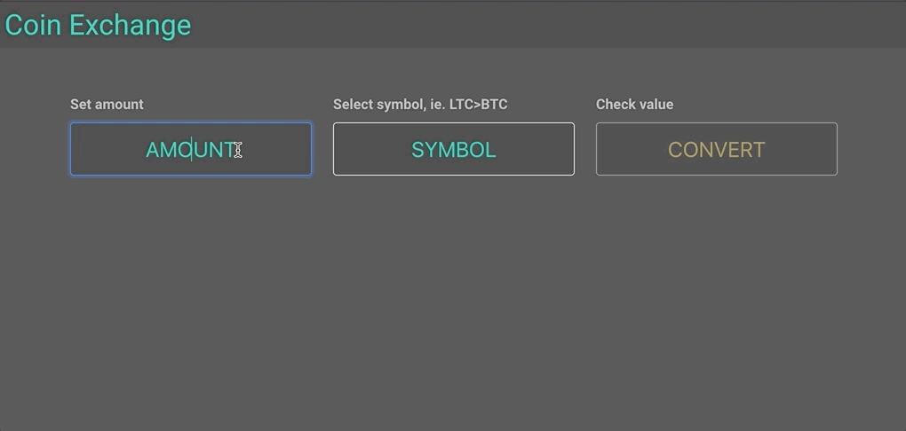

# coinx
lookup coin exchange rates and (try to) calculate profit via cross coin conversions

https://coin-ex.web.app/

### notes

- coin exchange rates are fetched from public [binance rest api](https://github.com/binance/binance-spot-api-docs/blob/master/rest-api.md)

### todo
- include market specific commission rates
- add multiple market apis
- find profitable exchange paths maybe?

---
***disclaimer***

*this personal project is not affiliated, associated, authorized, endorsed by, or in any way officially connected with the Binance, or any of its subsidiaries or its affiliates.*